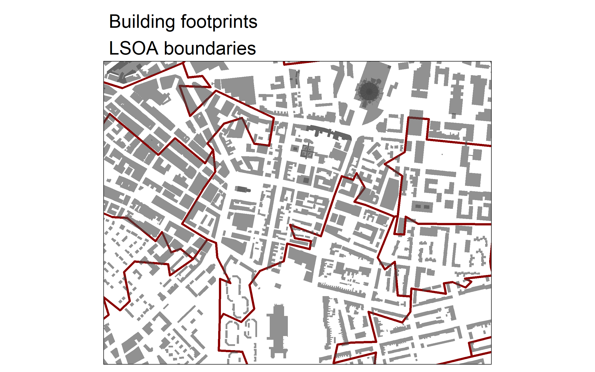

<p align="center">
  
  
</p>

## `extRatum` R package examples
This repository illustrates the use of the `extRatum` package.

- `code` folder contains notebooks with code to reproduce our examples;
- `outputs` folder contains the example outputs to explore the of use of `extRatum` package.

## Citation

To extract `extRatum` citation, type the following code:

```{r, eval = FALSE}
citation('extRatum')
```

```
## 
## To cite package 'extRatum' in publications use:
## 
##   Nikos Patias and Francisco Rowe (2021). extRatum: Summary Statistics
##   for Geospatial Features. R package version 1.0.4.
##   https://CRAN.R-project.org/package=extRatum
## 
## A BibTeX entry for LaTeX users is
## 
##   @Manual{,
##     title = {extRatum: Summary Statistics for Geospatial Features},
##     author = {Nikos Patias and Francisco Rowe},
##     year = {2021},
##     note = {R package version 1.0.4},
##     url = {https://CRAN.R-project.org/package=extRatum},
##   }
```